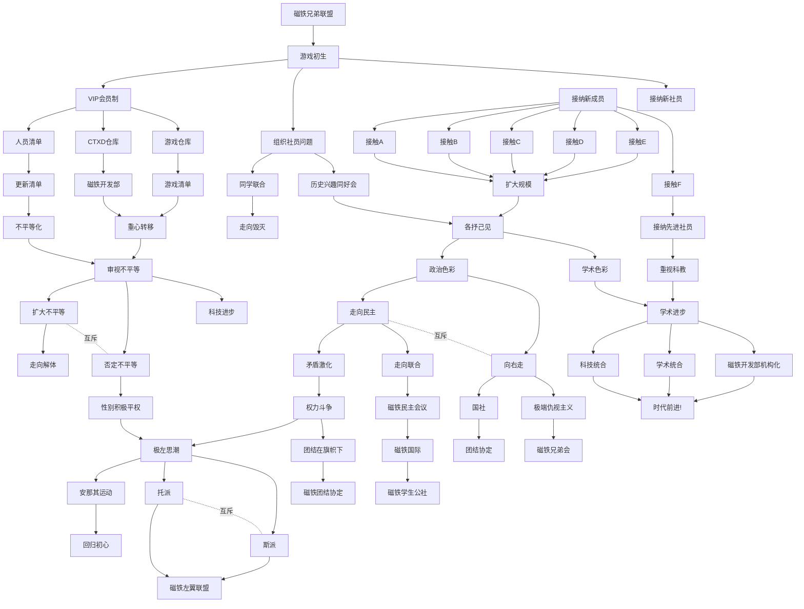

## [返回](index)

<audio id="audio" src="r01.wav"></audio>

<iframe frameborder="no" border="0" marginwidth="0" marginheight="0" width=330 height=86 src="//music.163.com/outchain/player?type=2&id=1973141814&auto=1&height=66"></iframe>

